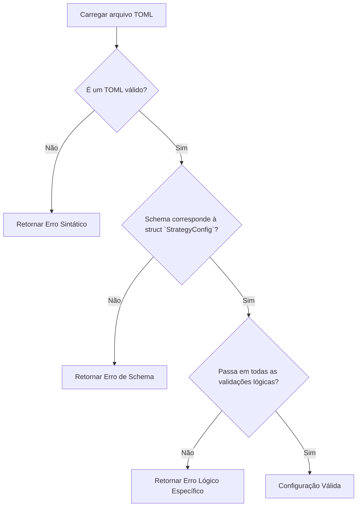

# Especificação Lógica 5: Sistema de Validação de Configurações

**Autor**: Manus AI
**Versão**: 1.0
**Data**: 2026-01-05

## 1. Introdução

Esta especificação detalha o sistema de validação para as configurações de estratégia do **Módulo de Parâmetros de Trade (TPM)**. A integridade e a lógica de cada arquivo de configuração são fundamentais para a estabilidade e a confiabilidade de todo o sistema de backtesting. Um arquivo mal configurado pode levar a erros de execução, resultados de backtest inválidos ou, pior, a uma otimização de estratégia baseada em premissas incorretas.

O sistema de validação será implementado dentro do **TPM Loader**, o crate Rust responsável por carregar e servir as configurações. A validação ocorrerá no momento do carregamento de uma configuração, garantindo que nenhum dado inválido seja propagado para as camadas de consumo (motor de backtesting e UI). O princípio é "*fail fast, fail early*": erros de configuração devem ser detectados e reportados o mais cedo possível.

## 2. Níveis de Validação

O processo de validação é dividido em três níveis, cada um com um escopo e propósito específicos:

1.  **Validação Sintática**: Garante que o arquivo é um TOML bem formado.
2.  **Validação de Schema**: Garante que o arquivo adere à estrutura de dados definida.
3.  **Validação Lógica**: Garante que os valores dos parâmetros são consistentes e fazem sentido dentro do contexto da estratégia.

| Nível | Ferramenta | O que Verifica | Exemplo de Erro |
| :--- | :--- | :--- | :--- |
| **Sintático** | Parser TOML (Rust) | A conformidade com a especificação TOML. | Falta de aspas em uma string, colchetes ausentes. |
| **Schema** | `serde` (Rust) | A presença de campos obrigatórios e os tipos de dados corretos. | Campo `strategy_id` ausente, `risk_per_trade_pct` como string. |
| **Lógico** | Lógica customizada no TPM Loader | A coerência entre os parâmetros. | `holding_period_min` > `holding_period_max`. |

## 3. Detalhamento das Regras de Validação

### 3.1. Validação Sintática e de Schema

Estas validações são, em grande parte, tratadas automaticamente pelo ecossistema Rust. Ao tentar deserializar o conteúdo de um arquivo TOML para a struct `StrategyConfig` usando a biblioteca `serde` e `toml`, qualquer desvio da estrutura definida resultará em um erro de parsing. [1]

```rust
// Exemplo simplificado no TPM Loader
let config: StrategyConfig = toml::from_str(&file_content)?;
// Se o parsing falhar, um TpmError::TomlError é retornado, cobrindo os níveis 1 e 2.
```

### 3.2. Validação Lógica

Este é o núcleo do sistema de validação e requer lógica de negócios customizada dentro do `TPM Loader`. As seguintes regras devem ser implementadas e verificadas após a deserialização bem-sucedida.

#### Regras de Validação Lógica

| Seção | Campo(s) | Regra de Validação | Mensagem de Erro |
| :--- | :--- | :--- | :--- |
| `metadata` | `strategy_id` | Deve corresponder ao nome do arquivo (sem a extensão `.toml`). | "Strategy ID não corresponde ao nome do arquivo." |
| `timeframe` | `holding_period_min`, `holding_period_max` | `holding_period_min` deve ser menor ou igual a `holding_period_max`. | "Período mínimo de holding não pode ser maior que o máximo." |
| `timeframe` | `lookback_bars`, `min_history_bars` | `lookback_bars` deve ser menor que `min_history_bars`. | "Lookback não pode ser maior que o histórico mínimo." |
| `position_sizing`| `risk_per_trade_pct` | Deve ser um valor positivo e, realisticamente, menor que 20%. | "Risco por trade deve ser um percentual positivo." |
| `position_sizing`| `max_position_pct` | Deve ser maior que `risk_per_trade_pct`. | "Posição máxima não pode ser menor que o risco por trade." |
| `risk_management`| `max_drawdown_pct` | Deve ser um valor positivo e menor que 100. | "Drawdown máximo deve ser um percentual válido." |
| `validation` | `train_test_split` | Deve ser um valor entre 0.0 e 1.0 (exclusivo). | "Divisão treino/teste deve estar entre 0 e 1." |
| `validation` | `wfa_enabled`, `wfa_num_folds` | Se `wfa_enabled` for `true`, `wfa_num_folds` deve ser `Some(>1)`. | "Walk-Forward Analysis requer um número de folds > 1." |
| `parameters` | `ma_fast_period`, `ma_slow_period` | Se ambos existirem, `ma_fast_period` deve ser menor que `ma_slow_period`. | "Média móvel rápida deve ter um período menor que a lenta." |
| `parameters` | `rsi_oversold`, `rsi_overbought` | Se ambos existirem, `rsi_oversold` deve ser menor que `rsi_overbought`. | "Nível de RSI oversold deve ser menor que overbought." |

### Diagrama de Fluxo da Validação



## 4. Tratamento de Erros

O `TPM Loader` deve retornar erros tipados e descritivos. Usando `thiserror`, podemos definir um enum `TpmError` que cubra todos os cenários de falha.

```rust
#[derive(Error, Debug)]
pub enum TpmError {
    #[error("Falha de I/O ao ler o arquivo: {0}")]
    Io(#[from] std::io::Error),

    #[error("Erro de parsing TOML: {0}")]
    Toml(#[from] toml::de::Error),

    #[error("Erro de validação lógica: {0}")]
    Validation(String),
    
    #[error("Estratégia não encontrada: {0}")]
    NotFound(String),
}
```

Quando uma validação lógica falhar, o `TPM Loader` retornará `Err(TpmError::Validation("Mensagem de Erro Específica"))`. Isso permite que as camadas de consumo tratem o erro de forma adequada, seja exibindo uma mensagem clara para o desenvolvedor que está editando os arquivos TOML, seja para o usuário final no dashboard.

## 5. Conclusão

Um sistema de validação robusto é a primeira linha de defesa contra a corrupção de dados e erros de lógica no processo de backtesting. Ao implementar estas três camadas de validação diretamente no `TPM Loader`, garantimos que apenas configurações sintaticamente corretas, estruturalmente válidas e logicamente coerentes sejam utilizadas pelo sistema. Isso aumenta a estabilidade, a confiabilidade e a manutenibilidade de todo o ecossistema de geração de estratégias.

A próxima especificação abordará a **Integração com o Algoritmo Genético**, detalhando como os parâmetros validados pelo TPM guiarão o processo de otimização.

## Referências

[1] The `serde` community. *Serde - A framework for serializing and deserializing Rust data structures efficiently and generically*. Disponível em: <https://serde.rs/>. Acessado em: 05 de janeiro de 2026.
