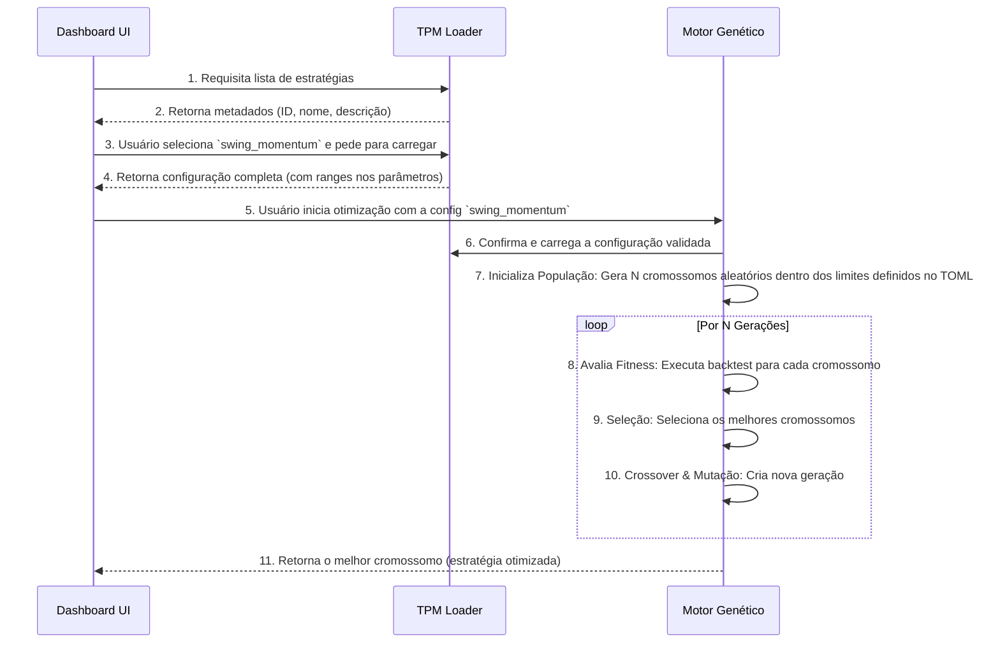

# Especificação Lógica 6: Integração com o Algoritmo Genético

**Autor**: Manus AI
**Versão**: 1.0
**Data**: 2026-01-05

## 1. Introdução

Esta especificação detalha a integração entre o **Módulo de Parâmetros de Trade (TPM)** e o motor de **Algoritmo Genético (GA)**. Esta integração é o coração do sistema de geração de estratégias, pois transforma o processo de busca, que seria puramente aleatório e ineficiente, em uma exploração inteligente e direcionada de um espaço de soluções promissoras.

O objetivo principal é usar as configurações do TPM para **definir e restringir o espaço de busca do GA**. Em vez de permitir que o GA teste qualquer combinação de parâmetros, o TPM fornece um "molde" ou "template" baseado em uma metodologia de trading conhecida. O GA, então, trabalha para encontrar a melhor combinação de parâmetros *dentro* dos limites e da lógica definidos por esse molde.

## 2. Conceitos Fundamentais

Para entender a integração, é crucial definir como os conceitos de um algoritmo genético são mapeados para o nosso problema de otimização de estratégias.

-   **Cromossomo**: Representa uma estratégia de trading completa e funcional. É um conjunto de todos os parâmetros que definem uma estratégia.
-   **Gene**: Representa um único parâmetro dentro da estratégia. Por exemplo, o período de uma média móvel, o nível de sobrecompra de um RSI, ou o valor de um stop loss.
-   **População**: Um conjunto de cromossomos (estratégias) que competem entre si em uma determinada geração.
-   **Função de Fitness**: Uma função que avalia a "qualidade" de um cromossomo. No nosso caso, é uma combinação de métricas de performance do backtest, como Sharpe Ratio, Calmar Ratio e drawdown máximo.
-   **Evolução**: O processo de selecionar os melhores cromossomos (seleção), combiná-los para criar novos (cruzamento ou crossover) e introduzir pequenas variações aleatórias (mutação) para criar a próxima geração.

## 3. O Papel do TPM na Definição do Espaço de Busca

O TPM não define um único cromossomo, mas sim o **universo de todos os cromossomos possíveis** para uma determinada família de estratégias. Ele faz isso de duas maneiras principais:

1.  **Definição Estrutural**: A própria estrutura do arquivo TOML (as regras de entrada/saída, os indicadores usados) define a lógica fixa da estratégia. O GA não pode mudar essa lógica; ele não pode, por exemplo, transformar uma estratégia de cruzamento de médias móveis em uma de reversão à média.

2.  **Definição de Limites dos Genes**: A seção `[parameters]` do arquivo TOML define os limites para cada gene (parâmetro). O GA usará esses limites para gerar a população inicial e para as operações de mutação.

### Mapeamento de Parâmetros para Genes

O motor do GA irá interpretar a seção `[parameters]` do TOML para criar o "genoma" da estratégia. A forma como os valores são especificados no TOML determina o comportamento do GA.

| Formato no TOML | Comportamento do GA | Exemplo |
| :--- | :--- | :--- |
| Valor Único | O gene é fixo e não será otimizado. | `ma_type = "SMA"` |
| Array com 2 Elementos | O gene pode variar entre o primeiro (mínimo) e o segundo (máximo) valor. | `ma_fast_period = [10, 30]` |
| Array com 3+ Elementos | O gene é categórico e só pode assumir um dos valores do array. | `bar_interval = ["1h", "4h", "1D"]` |

**Exemplo de seção `[parameters]` para otimização:**

```toml
[parameters]
# Gene 1: Período da média rápida (range contínuo)
ma_fast_period = [10, 40]

# Gene 2: Período da média lenta (range contínuo)
ma_slow_period = [50, 200]

# Gene 3: Tipo da média (categórico)
ma_type = ["SMA", "EMA"]

# Gene 4: Multiplicador de volume (fixo)
volume_multiplier = 1.2

# Gene 5: Período do ATR para stop (range contínuo)
atr_period = [10, 20]
```

Neste exemplo, o cromossomo de cada estratégia na população do GA terá 5 genes. Os genes 1, 2 e 5 serão números dentro dos ranges especificados. O gene 3 será ou "SMA" ou "EMA". O gene 4 será sempre `1.2`.

## 4. Fluxo de Integração

O processo de ponta a ponta, desde a seleção do usuário até a obtenção de uma estratégia otimizada, segue o fluxo abaixo.



## 5. Função de Fitness e Otimização

A seção `[optimization]` do arquivo TOML permite customizar a função de fitness para cada tipo de estratégia, tornando a otimização mais inteligente.

```toml
[optimization]
population_size = 150
max_generations = 100

# Pesos para a função de fitness
fitness_sharpe_weight = 1.5
fitness_cagr_weight = 1.0
fitness_drawdown_weight = 3.0 # Penalidade alta para drawdown
fitness_calmar_weight = 1.2

# Penalidades
low_trades_penalty = true
extreme_turnover_penalty = true
```

-   **Estratégias de Curto Prazo (Swing Trading)**: Podem ter um peso maior no `fitness_sharpe_weight`.
-   **Estratégias de Longo Prazo (Buy and Hold)**: Podem ter um peso maior no `fitness_cagr_weight` e `fitness_calmar_weight`.
-   **Estratégias de Alta Frequência (Intraday)**: Podem ter uma penalidade maior por `extreme_turnover_penalty` para controlar os custos.

## 6. Conclusão

A integração do TPM com o Algoritmo Genético é a peça chave que eleva o sistema de uma simples ferramenta de backtesting para uma poderosa máquina de descoberta de estratégias. Ao restringir o espaço de busca e guiar o processo de otimização com base em metodologias de trading validadas, o sistema pode gerar estratégias de alta qualidade de forma muito mais eficiente e com maior probabilidade de sucesso no mundo real.

A próxima especificação abordará a **UX do Dashboard para Seleção de Estratégias**, detalhando como o usuário irá interagir com o catálogo do TPM.
