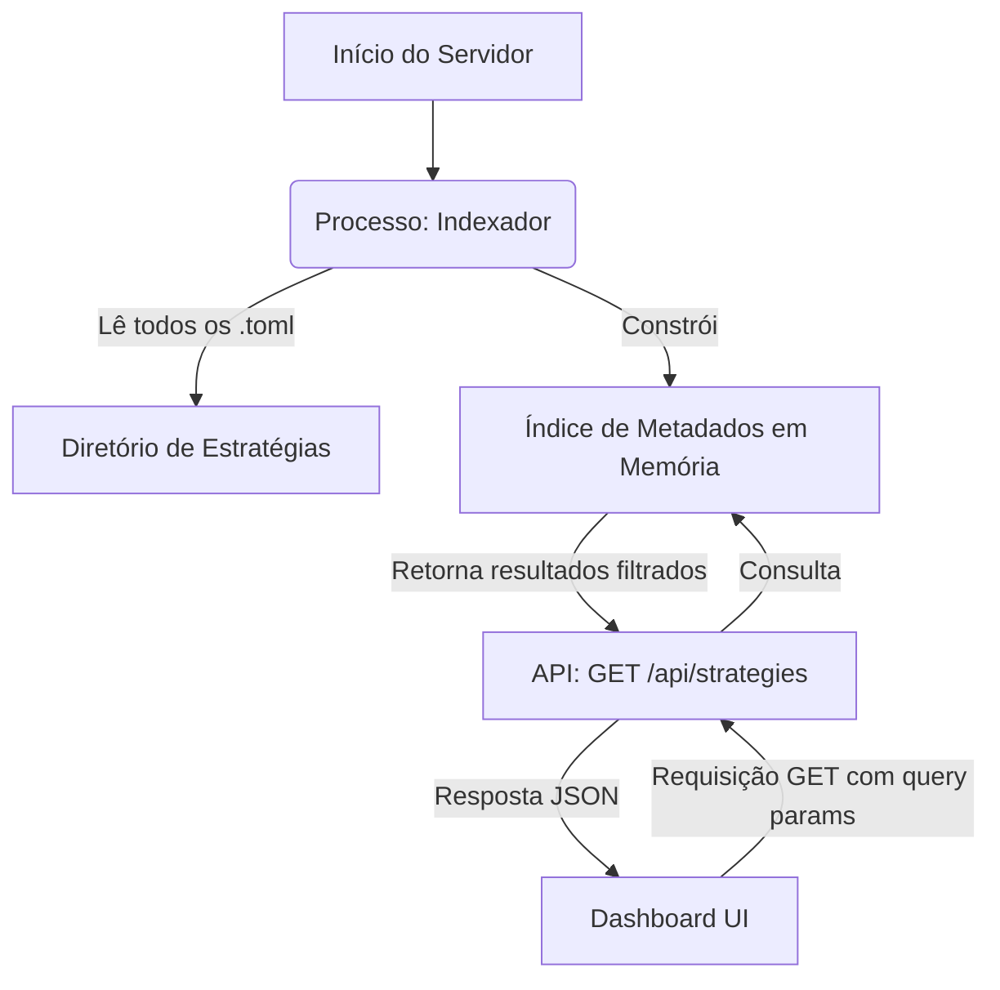

# Especificação Lógica 11: Sistema de Busca e Filtros

**Autor**: Manus AI
**Versão**: 1.0
**Data**: 2026-01-05

## 1. Introdução

Esta especificação detalha a arquitetura e a lógica do **Sistema de Busca e Filtros**, o motor por trás da tela de seleção de estratégias. Enquanto a especificação de UX focou no *o que* o usuário vê, esta foca no *como* o sistema entrega essa funcionalidade de forma eficiente e escalável. O objetivo é permitir que o usuário encontre rapidamente estratégias relevantes dentro de um catálogo de mais de 100 modelos, com base em múltiplos critérios.

Um sistema de busca e filtro performático é crucial para a usabilidade da plataforma. Uma busca lenta ou imprecisa pode frustrar o usuário e impedi-lo de descobrir os modelos mais adequados para suas necessidades. A solução deve ser rápida, precisa e capaz de lidar com o crescimento do catálogo de estratégias sem degradação de performance.

## 2. Arquitetura da Solução

Para garantir uma resposta rápida, a busca não será feita lendo e interpretando os arquivos TOML em tempo real a cada requisição. Em vez disso, construiremos um **índice de busca em memória** no momento da inicialização do servidor. Este índice conterá apenas os metadados necessários para a funcionalidade de busca e filtro.

### Componentes da Arquitetura

1.  **Indexador (Indexer)**: Um processo que é executado na inicialização do servidor. Ele varre o diretório de estratégias do TPM, lê a seção `[metadata]` de cada arquivo `.toml` e constrói o índice de busca.

2.  **Índice de Busca (Search Index)**: Uma estrutura de dados em memória (provavelmente um `Vec<StrategyMetadata>`) que armazena os metadados de todas as estratégias. Este índice é a fonte de dados para todas as operações de busca e filtro.

3.  **API de Busca (Search API)**: Um único endpoint de API (ex: `GET /api/strategies`) que aceita parâmetros de query para filtrar e buscar no índice em memória.

### Diagrama de Fluxo de Dados



## 3. O Processo de Indexação

O indexador é a parte mais crítica para a performance do sistema. Ele deve ser otimizado para ler os metadados rapidamente.

-   **Leitura Parcial de Arquivos**: O indexador **não deve** ler e fazer o parsing do arquivo TOML inteiro. Isso seria ineficiente. Em vez disso, ele deve ler o arquivo linha por linha até encontrar a seção `[metadata]` e parar de ler após ter extraído todos os seus campos. Uma abordagem com expressões regulares ou um parser de TOML mais granular pode ser usada para essa otimização.

-   **Estrutura de Dados do Índice**: O `TPM Loader` em Rust pode expor uma função `list_all_metadata()` que retorna um `Vec<Metadata>`, onde `Metadata` é a struct que corresponde à seção `[metadata]` do TOML. Esta `Vec` será o nosso índice.

    ```rust
    // Struct que representa um documento no nosso índice
    #[derive(Debug, Clone, Serialize, Deserialize)]
    pub struct Metadata {
        pub strategy_id: String,
        pub name: String,
        pub description: String,
        pub risk_profile: RiskProfile, // Enum
        pub family: StrategyFamily,   // Enum
        pub tags: Vec<String>,
        // ... outros campos de metadados
    }
    ```

-   **Atualização do Índice**: Inicialmente, o índice será construído apenas na inicialização. Para um sistema mais avançado, um mecanismo de *hot-reloading* poderia ser implementado para observar mudanças no diretório de estratégias e atualizar o índice sem reiniciar o servidor.

## 4. Lógica de Busca e Filtro

Toda a lógica de busca e filtro será implementada no backend, dentro do handler da API `GET /api/strategies`. O frontend apenas envia os parâmetros de query.

### 4.1. API Endpoint

**`GET /api/strategies`**

**Parâmetros de Query:**

-   `q` (string): Termo de busca textual. Ex: `q=momentum`.
-   `risk_profile` (string, múltiplo): Filtra por um ou mais perfis de risco. Ex: `risk_profile=conservative&risk_profile=moderate`.
-   `family` (string, múltiplo): Filtra por uma ou mais famílias de estratégia. Ex: `family=swing&family=pair`.
-   `sort_by` (string): Campo para ordenação. Ex: `sort_by=name`.
-   `order` (string): Direção da ordenação. Ex: `order=asc`.

### 4.2. Lógica de Filtragem no Backend

O handler da API aplicará os filtros em sequência sobre o índice em memória.

1.  **Começa com o índice completo**: `let results = search_index.clone();`

2.  **Aplica filtro de `risk_profile`**: Se o parâmetro `risk_profile` estiver presente, filtra o `results` para manter apenas as estratégias cujo `risk_profile` corresponda a um dos valores fornecidos.

3.  **Aplica filtro de `family`**: Similarmente, filtra o `results` com base no parâmetro `family`.

4.  **Aplica busca textual (`q`)**: Se o parâmetro `q` estiver presente, filtra o `results` para manter apenas as estratégias que correspondam ao termo de busca. A busca deve ser *case-insensitive* e verificar a correspondência nos seguintes campos:
    -   `name`
    -   `description`
    -   `tags` (em cada elemento do array)

5.  **Ordenação**: Aplica a ordenação final com base nos parâmetros `sort_by` e `order`.

6.  **Retorno**: Retorna o `Vec<Metadata>` resultante como uma resposta JSON.

### Exemplo de Implementação (Pseudo-código Rust com `axum`)

```rust
async fn get_strategies(Query(params): Query<SearchParams>, State(index): State<Arc<Vec<Metadata>>>) -> Json<Vec<Metadata>> {
    let mut results = index.as_ref().clone();

    if let Some(risk_profiles) = params.risk_profile {
        results.retain(|s| risk_profiles.contains(&s.risk_profile));
    }

    if let Some(families) = params.family {
        results.retain(|s| families.contains(&s.family));
    }

    if let Some(query) = params.q {
        let query_lower = query.to_lowercase();
        results.retain(|s| {
            s.name.to_lowercase().contains(&query_lower) ||
            s.description.to_lowercase().contains(&query_lower) ||
            s.tags.iter().any(|tag| tag.to_lowercase().contains(&query_lower))
        });
    }

    // Lógica de ordenação aqui...

    Json(results)
}
```

## 5. Performance e Escalabilidade

-   **Índice em Memória**: Para um catálogo de centenas ou mesmo alguns milhares de estratégias, um índice em memória é extremamente rápido. A filtragem de um `Vec` em Rust é uma operação de nanossegundos.

-   **Cache de API**: Embora a operação seja rápida, os resultados da API podem ser cacheados em um nível superior (ex: com um proxy reverso como Nginx ou em um cache como Redis) para requisições idênticas, especialmente para a chamada inicial sem filtros.

-   **Escalabilidade Futura**: Se o catálogo crescer para dezenas de milhares de estratégias, a abordagem de índice em memória pode ser substituída por uma solução de busca dedicada como **MeiliSearch** ou **Tantivy** (uma biblioteca de busca full-text em Rust), sem alterar a interface da API. [1]

## 6. Conclusão

O Sistema de Busca e Filtros, baseado em um índice de metadados em memória, fornece uma solução robusta e de alta performance para a descoberta de estratégias no dashboard. Ao desacoplar a busca dos arquivos físicos e pré-processar os dados na inicialização, garantimos uma experiência de usuário fluida e responsiva. A arquitetura é simples, eficiente e possui um caminho claro para escalabilidade futura, caso seja necessário.

A próxima especificação abordará o **Catálogo de 116 Estratégias Pré-configuradas**, fornecendo uma lista e breve descrição de todos os modelos que serão incluídos na versão inicial do TPM.

## Referências

[1] The Tantivy Community. *Tantivy - A full-text search engine library inspired by Apache Lucene and written in Rust*. Disponível em: <https://github.com/quickwit-oss/tantivy>. Acessado em: 05 de janeiro de 2026.
