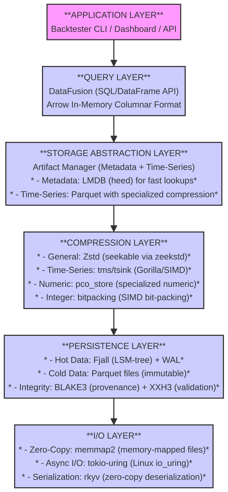
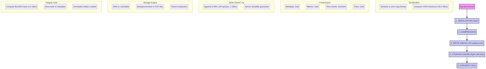
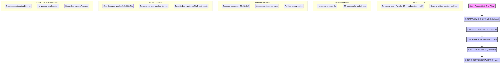

# Arquitetura do Sistema de Arquivos Binário para Backtesting de Alta Performance

**Document Version**: 1.0.0  
**Date**: 2026-01-04  
**Status**: Design

---

## 1. Visão Geral da Arquitetura

Este documento detalha a arquitetura do **Sistema de Arquivos Binário Otimizado (OBFS - Optimized Binary File System)**, projetado para atender aos requisitos de ultra-performance, compressão máxima e integridade criptográfica do sistema de backtesting. A arquitetura é baseada nos resultados da pesquisa profunda e nos requisitos técnicos sintetizados.

### 1.1. Princípios de Design

- **Imutabilidade como Base**: Cada artefato de backtest é um registro imutável. Não há atualizações ou exclusões, apenas adições, garantindo a preservação completa das evidências.
- **Compressão em Múltiplas Camadas**: A compressão não é um passo único, mas uma pipeline que aplica o algoritmo mais eficaz para cada tipo de dado (colunar, numérico, texto).
- **Zero-Copy na Leitura**: O design prioriza a leitura de dados sem cópias intermediárias de memória, utilizando memory-mapping e formatos de serialização que permitem acesso direto.
- **Integridade Verificável**: Cada dado e artefato possui checksums para validação rápida (XXH3) e hashes criptográficos para prova de origem (BLAKE3).
- **Abstração de Armazenamento**: O sistema é composto por um conjunto de arquivos e bancos de dados especializados, em vez de um único arquivo monolítico, permitindo otimizações independentes.

### 1.2. Diagrama de Arquitetura em Camadas

O OBFS é estruturado em camadas lógicas, cada uma com uma responsabilidade clara, desde a interface com a aplicação até o armazenamento físico dos dados.



---

## 2. Componentes Detalhados

### 2.1. Camada de Interface da Aplicação

- **`ArtifactWriter`**: A única interface para a aplicação de backtesting escrever novos artefatos. Ele orquestra a serialização, compressão e persistência.
- **`ArtifactReader`**: A interface para ler artefatos. Ele gerencia a busca de metadados, a descompressão e a deserialização zero-copy.

### 2.2. Camada de Gerenciamento de Artefatos

- **`MetadataStore` (LMDB/heed)**: Um banco de dados chave-valor de altíssima performance para leituras concorrentes. Armazena o "índice" do sistema:
    - `backtest_uuid -> artifact_location`: Mapeia um UUID para a localização física do artefato (e.g., offset em um arquivo maior).
    - `backtest_uuid -> blake3_hash`: Armazena o hash criptográfico para verificação de integridade.
    - `backtest_uuid -> metrics.json`: Armazena as métricas diretamente para acesso ultra-rápido, evitando a leitura do artefato completo.
- **`TimeSeriesStore` (Parquet)**: O armazenamento principal para os dados de séries temporais. Os dados de todos os backtests são agregados em grandes arquivos Parquet particionados, permitindo compressão e consultas colunares eficientes.

### 2.3. Camada de Compressão e Serialização

- **`Serializer` (rkyv)**: Converte as estruturas de dados em Rust para um formato binário zero-copy.
- **`CompressionPipeline`**: Aplica uma cadeia de algoritmos de compressão:
    1. **Delta Encoding + `pco_store`** para colunas numéricas (`equity`, `drawdown`).
    2. **Dictionary Encoding** para colunas de baixa cardinalidade (`backtest_uuid`).
    3. **`zstd`** como compressor final para os blocos de dados.

### 2.4. Camada de Persistência e Integridade

- **`StorageEngine` (Arquivo Simples + mmap)**: O nível mais baixo, que escreve os bytes em arquivos no sistema de arquivos do SO. Utiliza `memmap2` para mapear os arquivos em memória para leitura zero-copy.
- **`IntegrityEngine`**: Calcula e verifica os hashes:
    - **`XXH3`**: Gerado para cada bloco de dados escrito, usado para validação rápida na leitura.
    - **`BLAKE3`**: Gerado para o artefato completo, armazenado no `MetadataStore` para prova de origem.
- **`WriteAheadLog` (walrus-rust)**: Garante a durabilidade das escritas. Todas as operações são primeiro registradas no WAL antes de serem aplicadas ao `StorageEngine`.

---

## 3. Fluxos de Dados

### 3.1. Fluxo de Escrita (Ingestão de Backtest)

O processo de salvar um novo resultado de backtest é uma pipeline otimizada para performance e durabilidade.



**Passos:**
1.  **Receber Artefato**: O `ArtifactWriter` recebe os dados do backtest (metadados, métricas, série temporal, trace).
2.  **Serializar Dados**: Os dados da série temporal são serializados para o formato colunar Arrow.
3.  **Comprimir Colunas**: O `CompressionPipeline` aplica as compressões especializadas em cada coluna.
4.  **Agregar em Bloco**: Os dados comprimidos são agrupados em um bloco de artefato.
5.  **Calcular Hashes**: O `IntegrityEngine` calcula o hash XXH3 do bloco e o hash BLAKE3 do artefato.
6.  **Escrever no WAL**: O bloco é escrito no `WriteAheadLog` para garantir durabilidade.
7.  **Persistir Bloco**: O bloco é anexado ao arquivo de armazenamento principal (`*.obfs`).
8.  **Atualizar Metadados**: A localização do bloco e o hash BLAKE3 são escritos no `MetadataStore` (LMDB).

### 3.2. Fluxo de Leitura (Consulta de Backtest)

O processo de leitura é otimizado para latência mínima, aproveitando o zero-copy e o acesso direto.



**Passos:**
1.  **Receber Consulta**: O `ArtifactReader` recebe um `backtest_uuid`.
2.  **Consultar Metadados**: Acessa o `MetadataStore` (LMDB) para obter a localização do artefato e seu hash BLAKE3.
3.  **Mapear Arquivo**: Utiliza `memmap2` para mapear o arquivo de armazenamento (`*.obfs`) na memória.
4.  **Acessar Bloco**: Acessa diretamente o slice de bytes (`&[u8]`) correspondente ao bloco do artefato, sem ler o arquivo inteiro.
5.  **Validar Integridade (XXH3)**: Calcula o hash XXH3 do bloco em memória e compara com o checksum armazenado para detectar corrupção.
6.  **Deserialização Zero-Copy (rkyv)**: Utiliza `rkyv` para criar uma visão (`Archived<... >`) sobre o buffer de memória, sem nenhuma alocação ou cópia de dados.
7.  **Descompressão Parcial**: Apenas as colunas solicitadas da série temporal são descomprimidas sob demanda.
8.  **Retornar Visão**: Retorna uma estrutura de dados que referencia diretamente a memória mapeada, pronta para uso pela aplicação.

---

## 4. Layout de Armazenamento Físico

O sistema não é um único arquivo, mas um diretório estruturado contendo bancos de dados e arquivos de dados otimizados para suas respectivas funções.


- **`artifacts/`**: Diretório raiz do OBFS.
    - **`metadata.lmdb`**: Banco de dados LMDB contendo todos os metadados e índices. Otimizado para leituras rápidas e concorrentes.
    - **`wal/`**: Diretório para os arquivos do Write-Ahead Log. Garante a durabilidade das escritas.
    - **`data/`**: Diretório contendo os blocos de dados principais.
        - **`data_0000.obfs`**: Arquivo de blocos de artefatos. Os resultados dos backtests são anexados a esses arquivos. São criados novos arquivos quando atingem um tamanho limite (e.g., 1 GB) para facilitar o gerenciamento.
        - **`timeseries_0000.parquet`**: Arquivos Parquet contendo os dados de séries temporais de múltiplos backtests, otimizados para análise e consultas colunares.

---

## 5. Modelo de Dados e Esquemas

### 5.1. Esquema do Artefato (Serializado com `rkyv`)

```rust
use rkyv::{Archive, Serialize, Deserialize};

#[derive(Archive, Serialize, Deserialize)]
pub struct BacktestArtifact {
    pub metadata: Archived<Metadata>,
    pub metrics: Archived<Metrics>,
    // A série temporal é armazenada separadamente em Parquet
    // Aqui, apenas uma referência ou um resumo pode ser mantido
    pub timeseries_ref: TimeseriesReference,
    pub trace: Archived<Vec<TraceEvent>>,
    pub integrity: IntegritySeal,
}

#[derive(Archive, Serialize, Deserialize)]
pub struct IntegritySeal {
    pub block_xxh3: u64,
    pub artifact_blake3: [u8; 32],
}
```

### 5.2. Esquema da Série Temporal (Parquet)

Para maximizar a compressão, os dados de séries temporais de todos os backtests são armazenados juntos em um formato "longo", permitindo a deduplicação massiva da coluna de data.

| Nome da Coluna | Tipo de Dados | Codificação Parquet | Descrição |
|---|---|---|---|
| `backtest_uuid` | `UUID` (16 bytes) | `DICTIONARY` | Identificador único do backtest. |
| `date_offset` | `UINT16` | `DELTA` | Dias desde uma data de época (e.g., 2020-01-01). |
| `equity` | `FLOAT32` | `DELTA` + `PCO` | Valor do equity. |
| `drawdown` | `FLOAT32` | `DELTA` + `PCO` | Valor do drawdown. |
| `exposure` | `FLOAT32` | `DELTA` + `PCO` | Exposição da estratégia. |

**Nota**: As colunas vazias (`vol_exante`, etc.) não são armazenadas, economizando espaço por padrão.

---

## 6. Conclusão

A arquitetura proposta atende a todos os requisitos de design, combinando as melhores tecnologias e técnicas identificadas na pesquisa. Ela oferece um caminho claro para construir um sistema de armazenamento de backtests que é, ao mesmo tempo, extremamente eficiente em espaço, ultra-rápido em acesso e criptograficamente seguro, fornecendo uma base sólida para a próxima geração da plataforma de backtesting.
