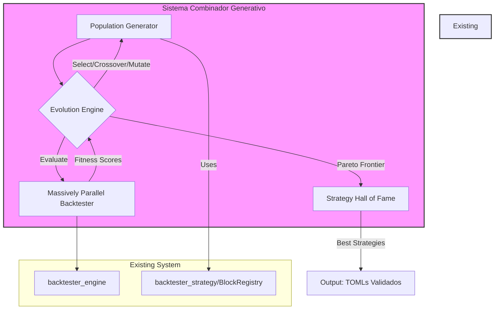

# Especificação de Arquitetura: Sistema Combinador Generativo (SCG)

**Autor**: Manus AI, emulando Chefe de Pesquisa Quantitativa
**Versão**: 1.0
**Data**: 2025-12-28

## 1. Resumo Executivo

Esta especificação de arquitetura de alto nível descreve o **Sistema Combinador Generativo (SCG)**, uma plataforma de pesquisa quantitativa de próxima geração projetada para descobrir, otimizar e validar robustamente estratégias de trading de alta performance. O SCG se integrará ao ecossistema de backtesting existente, alavancando sua arquitetura performática em Rust para implementar um processo de descoberta de estratégias baseado em **Algoritmos Genéticos (AG)** e **Torneios Evolutivos**.

O objetivo primário é automatizar a busca por configurações ótimas de "blocos" de estratégia e seus parâmetros, superando a otimização manual e explorando um universo vasto de possibilidades de forma sistemática. A arquitetura prioriza **rigor estatístico**, com ênfase em validação **out-of-sample (OOS)** e técnicas anti-overfitting, e **ultra-performance** através de paralelização massiva e otimizações de baixo nível em Rust.

## 2. Princípios de Design

| Princípio | Descrição |
|---|---|
| **Exploração Genética** | Utilizar algoritmos genéticos para navegar eficientemente pelo vasto espaço de combinações de blocos e parâmetros, tratando estratégias como "genomas" que evoluem. |
| **Competição Evolutiva** | Empregar um sistema de torneios para selecionar as estratégias mais "aptas", promovendo a sobrevivência dos modelos mais robustos e lucrativos, similar à seleção natural. |
| **Rigor Anti-Overfitting** | Incorporar nativamente metodologias de validação robustas, como Walk-Forward Analysis e avaliação da probabilidade de overfitting (PBO), para garantir que a performance não seja uma miragem estatística. |
| **Otimização Multi-Objetivo** | Avaliar estratégias com base em uma fronteira de Pareto de múltiplos objetivos (e.g., retorno, risco, drawdown), em vez de uma única métrica, para encontrar um balanço ótimo. |
| **Performance Extrema** | Projetar todos os componentes para performance máxima, utilizando a stack Rust existente, paralelização em nível de CPU e GPU, e estruturas de dados eficientes (SoA). |
| **Modularidade e Extensibilidade** | O SCG será um novo conjunto de crates (`combiner_core`, `combiner_engine`) que se acopla ao sistema atual, permitindo a evolução independente de ambos. |

## 3. Arquitetura Proposta

O SCG será introduzido como uma nova camada de "Inteligência Meta-Estratégica" que orquestra o `backtester_strategy` e o `backtester_engine` existentes. Ele será responsável por gerar, avaliar e evoluir populações de estratégias.

### 3.1. Diagrama de Componentes



### 3.2. Descrição dos Componentes

**1. Representação da Estratégia (Genoma):**
   - Uma estratégia será representada como um "genoma", uma estrutura de dados em Rust que define uma combinação de blocos e seus parâmetros.
   - **Genótipo**: Uma `struct` em Rust contendo `Vec<Gene>`, onde cada `Gene` representa um bloco (`block_id`) e seus valores de parâmetros.
   - **Fenótipo**: A tradução do genoma em um arquivo de configuração `.toml` que o `backtester_strategy` pode consumir. Este processo é a expressão do gene.

**2. Gerador de População (`Population Generator`):**
   - Responsável por criar a população inicial de genomas (estratégias).
   - Ele consulta o `BlockRegistry` para obter a lista de blocos disponíveis (Selection, Entry, Exit, Sizing) e os ranges válidos para seus parâmetros.
   - Gera N genomas aleatórios, criando uma população diversificada para o início do processo evolutivo.

**3. Motor de Evolução (`Evolution Engine`):**
   - O núcleo do SCG, implementando o loop do algoritmo genético.
   - **Fitness Evaluation**: Orquestra o `Massively Parallel Backtester` para calcular a "aptidão" de cada estratégia na população. A função de fitness será multi-objetivo, considerando métricas como Sharpe Ratio, Calmar Ratio, Max Drawdown, e Profit Factor.
   - **Seleção (Torneio)**: Implementa `Tournament Selection`. Um subconjunto aleatório de k estratégias é selecionado da população, e a de maior fitness vence o torneio, sendo promovida para o "mating pool".
   - **Crossover**: Cria "filhos" a partir de dois pais do mating pool. O crossover pode ocorrer em nível de bloco (trocando o bloco de `entry` entre dois pais) ou em nível de parâmetro (interpolação de valores).
   - **Mutação**: Aplica pequenas mudanças aleatórias nos genomas dos filhos para introduzir diversidade e evitar mínimos locais. Exemplos: alterar o valor de um parâmetro, trocar um bloco por outro do mesmo tipo (e.g., `momentum` por `low_vol`).

**4. Backtester Paralelo Massivo (`Massively Parallel Backtester`):**
   - Uma camada de orquestração que executa backtests para uma população inteira em paralelo.
   - Utilizará a biblioteca `rayon` para paralelismo em nível de CPU, distribuindo a avaliação de N estratégias entre todos os cores disponíveis.
   - A arquitetura será projetada para futura integração com simulação em GPU (via CUDA/Rust ou OpenCL), inspirado pela pesquisa em FinRL que demonstra speedups de >1000x. Isso é crucial para a viabilidade de populações grandes.

**5. Hall da Fama de Estratégias (`Strategy Hall of Fame`):**
   - Um componente que armazena as melhores estratégias encontradas ao longo de todas as gerações, com base na fronteira de Pareto.
   - A fronteira de Pareto conterá as estratégias não-dominadas, ou seja, aquelas para as quais não existe outra estratégia que seja melhor em um objetivo sem ser pior em outro (e.g., maior retorno para o mesmo nível de risco).
   - Este componente garante que as melhores soluções não sejam perdidas entre as gerações.

## 4. Integração com o Sistema Existente

O SCG será um novo crate binário (`strategy_combiner_cli`) que utiliza os crates existentes como bibliotecas.

- **Entrada**: O `combiner` receberá um arquivo de configuração definindo os parâmetros da busca genética (tamanho da população, número de gerações, taxas de mutação/crossover) e os critérios de validação (configuração do Walk-Forward).
- **Orquestração**: O `combiner` irá:
    1. Gerar a população de genomas.
    2. Para cada genoma, gerar o fenótipo (`.toml`).
    3. Invocar o `backtester_cli run` (ou diretamente a função `run` do `ExperimentRunner`) para cada `.toml`, em paralelo.
    4. Coletar os `metrics.json` de cada execução para calcular o fitness.
    5. Executar o ciclo de evolução (seleção, crossover, mutação).
- **Saída**: Ao final das N gerações, o `combiner` produzirá um relatório com as estratégias do `Hall of Fame`, incluindo seus arquivos `.toml` e um sumário de suas métricas na fronteira de Pareto.

## 5. Próximos Passos

A próxima fase do projeto detalhará a implementação de cada um desses componentes, começando pela especificação dos torneios evolutivos e a estrutura exata dos genomas. Foco será dado à definição da função de fitness multi-objetivo e ao design do `Massively Parallel Backtester`.


## 6. Especificação de Torneios Evolutivos e Algoritmos Genéticos

Esta seção detalha a mecânica do `Evolution Engine`, o coração do Sistema Combinador Generativo. O processo é projetado para emular a seleção natural, onde apenas as estratégias mais "aptas" sobrevivem e se reproduzem, levando a uma melhoria contínua da população ao longo das gerações.

### 6.1. Estrutura do Genoma da Estratégia

O genoma de uma estratégia (`StrategyGenome`) é a sua representação fundamental em código, a partir da qual o seu fenótipo (o arquivo `.toml` executável) é gerado. A estrutura será definida em Rust para máxima performance e segurança de tipos.

```rust
// Crate: combiner_core

/// Representa um único gene, que pode ser um bloco ou um parâmetro.
enum Gene {
    BlockGene { block_type: BlockType, block_id: String },
    ParamGene { block_id: String, param_name: String, value: f64 },
}

/// O genoma completo de uma estratégia.
struct StrategyGenome {
    id: Uuid,
    genes: Vec<Gene>,
    fitness: Option<MultiObjectiveFitness>,
}

/// Tipos de blocos existentes no sistema.
enum BlockType { Selection, Entry, Exit, Sizing }
```

- **Flexibilidade**: Esta estrutura permite genomas de comprimento variável, possibilitando a descoberta de pipelines com diferentes números de blocos.
- **Validação**: Uma função de validação garantirá que um genoma seja "válido" antes da avaliação, verificando, por exemplo, se ele contém pelo menos um bloco de cada tipo (`Selection`, `Sizing`) e se os parâmetros estão dentro dos limites definidos no `BlockRegistry`.

### 6.2. Função de Fitness Multi-Objetivo e Fronteira de Pareto

Abandonamos a abordagem de uma única métrica de fitness. Em vez disso, avaliaremos as estratégias em um espaço multi-objetivo para capturar o trade-off fundamental entre risco e retorno. A "aptidão" não será um único número, mas sim a sua posição em relação à fronteira de Pareto.

- **Objetivos de Otimização**: Os objetivos primários serão:
    1. **Maximizar**: Retorno Anualizado (CAGR)
    2. **Minimizar**: Maximum Drawdown (MDD)
    3. **Maximizar**: Sharpe Ratio (ou Calmar/Sortino Ratio)

- **Dominância de Pareto**: Uma Estratégia A *domina* uma Estratégia B se A é estritamente melhor que B em pelo menos um objetivo e não é pior que B em nenhum dos outros.
- **Fronteira de Pareto**: O conjunto de todas as estratégias não-dominadas na população atual. Estas são as melhores soluções de trade-off encontradas.

```rust
// Crate: combiner_core

struct MultiObjectiveFitness {
    cagr: f64,
    max_drawdown: f64, // Deve ser negativo para minimização
    sharpe_ratio: f64,
}
```

### 6.3. Mecânica do Torneio Evolutivo

O ciclo de vida de uma geração se dará da seguinte forma:

**1. Avaliação (Backtest):**
   - Todos os genomas da população atual são convertidos em arquivos `.toml`.
   - O `Massively Parallel Backtester` executa os backtests.
   - Os `metrics.json` resultantes são usados para popular a `MultiObjectiveFitness` de cada genoma.

**2. Seleção (Tournament Selection):**
   - Para preencher o "mating pool" (piscina de reprodução), repetimos o seguinte processo:
     a. Selecionar `k` (e.g., `k=3`) indivíduos aleatoriamente da população.
     b. Dentre os `k` indivíduos, o "vencedor" é aquele que é menos dominado. Se houver um empate (múltiplos indivíduos na fronteira de Pareto local), um vencedor é escolhido aleatoriamente entre eles.
     c. O vencedor é adicionado ao mating pool.
   - Este método é computacionalmente eficiente e mantém a pressão seletiva.

**3. Crossover (Reprodução):**
   - Dois pais são selecionados aleatoriamente do mating pool.
   - Um operador de crossover é aplicado com uma probabilidade `p_crossover`.
   - **Operadores de Crossover:**
     - **Single-Point Crossover**: Um ponto de cruzamento é escolhido no genoma. O filho 1 recebe a primeira parte do Pai 1 e a segunda parte do Pai 2. O filho 2 recebe o inverso.
     - **Uniform Crossover**: Para cada gene, é decidido aleatoriamente de qual pai ele será herdado.
     - **Block-Level Crossover**: Troca blocos inteiros (e.g., o bloco `entry` do Pai 1 com o do Pai 2).

**4. Mutação:**
   - Cada gene no genoma de um filho tem uma pequena probabilidade `p_mutation` de sofrer uma mutação.
   - **Operadores de Mutação:**
     - **Parameter Mutation**: Para um `ParamGene`, o valor é alterado ligeiramente (e.g., adicionando um pequeno ruído gaussiano), respeitando os limites do parâmetro.
     - **Block Mutation**: Para um `BlockGene`, o `block_id` é trocado por outro bloco do mesmo `BlockType` (e.g., `rsi` -> `macd`).
     - **Structural Mutation**: Adiciona ou remove um bloco do pipeline (respeitando as restrições do pipeline).

**5. Elitismo e Formação da Nova Geração:**
   - A nova população é formada pelos filhos gerados.
   - Para garantir que as melhores soluções não sejam perdidas, uma porcentagem das melhores estratégias da geração anterior (a elite, baseada na fronteira de Pareto) é transferida diretamente para a nova geração. Isso é conhecido como **elitismo**.

### 6.4. Hiperparâmetros do Algoritmo Genético

A configuração do `Evolution Engine` será definida em um arquivo TOML, permitindo o ajuste fino da busca.

| Parâmetro | Descrição | Valor Sugerido |
|---|---|---|
| `population_size` | Número de estratégias em cada geração. | 200 - 1000 |
| `num_generations` | Número de ciclos de evolução a executar. | 50 - 200 |
| `tournament_size` (`k`) | Número de indivíduos por torneio de seleção. | 3 - 7 |
| `crossover_rate` | Probabilidade de aplicar crossover a um par de pais. | 0.8 - 0.95 |
| `mutation_rate` | Probabilidade de um gene sofrer mutação. | 0.01 - 0.1 |
| `elitism_rate` | Percentual da população anterior a ser transferido para a próxima. | 0.05 - 0.1 |


## 7. Métricas, Validação e Rigor Anti-Overfitting

Uma estratégia de trading só é valiosa se sua performance for genuína e robusta, não um artefato de overfitting. Esta seção define o framework de validação rigoroso que será a espinha dorsal do Sistema Combinador Generativo, garantindo que apenas as estratégias com maior probabilidade de sucesso em mercados reais sejam selecionadas.

### 7.1. Framework de Validação: Walk-Forward Analysis (WFA)

O WFA é a principal metodologia para avaliar a robustez de uma estratégia ao longo do tempo. Ele simula como uma estratégia teria sido otimizada e negociada em tempo real, usando uma janela deslizante de dados para treinamento (In-Sample) e teste (Out-of-Sample).

- **Processo**: O conjunto de dados históricos é dividido em `N` blocos. O processo de WFA consiste em `N-k` passos, onde `k` é o número de blocos usados para o treinamento inicial.

| Passo | Período de Treinamento (In-Sample) | Período de Teste (Out-of-Sample) |
|---|---|---|
| 1 | Blocos 1 a `k` | Bloco `k+1` |
| 2 | Blocos 2 a `k+1` | Bloco `k+2` |
| ... | ... | ... |
| `N-k` | Blocos `N-k` a `N-1` | Bloco `N` |

- **Aplicação no SCG**: O processo de otimização genética (gerações, torneios) será executado dentro de cada período In-Sample. A melhor estratégia encontrada (do `Hall of Fame` daquela otimização) é então testada, *uma única vez e sem alterações*, no período Out-of-Sample subsequente. A performance OOS concatenada de todos os passos forma a verdadeira curva de equity da meta-estratégia.

### 7.2. Métricas de Performance e Robustez

As métricas serão calculadas tanto para os períodos IS quanto para os OOS, permitindo uma análise de degradação.

| Métrica | Categoria | Descrição | Propósito no SCG |
|---|---|---|---|
| **CAGR** | Retorno | Taxa de Crescimento Anual Composta. | Medida primária de lucratividade. |
| **Max Drawdown (MDD)** | Risco | A maior perda percentual do pico ao vale. | Medida primária de risco e dor do investidor. |
| **Sharpe Ratio** | Risco-Retorno | Retorno ajustado pelo risco (volatilidade). | Métrica padrão da indústria para qualidade do retorno. |
| **Calmar Ratio** | Risco-Retorno | CAGR / MDD. Foca na recuperação de drawdowns. | Essencial para avaliar a resiliência da estratégia. |
| **Profit Factor** | Consistência | Lucro bruto / Prejuízo bruto. | Mede a magnitude dos ganhos em relação às perdas. |
| **IS/OOS Degradation** | Robustez | `(Metric_IS - Metric_OOS) / Metric_IS` | **CRÍTICO**. Uma degradação alta (>30%) é um forte sinal de overfitting. Será um critério de descarte. |
| **Trades per Período** | Significância | Número de operações no período OOS. | Garante que a performance não é baseada em sorte com poucos trades. Mínimo de 30-50 trades por janela OOS. |

### 7.3. Técnicas Avançadas de Anti-Overfitting

Para atender à exigência de rigor de nível institucional, o SCG implementará técnicas de ponta da pesquisa quantitativa, inspiradas nos trabalhos de Marcos López de Prado e David H. Bailey.

**1. Combinatorial Purged Cross-Validation (CPCV):**
   - Uma melhoria sobre o WFA. O CPCV testa todas as combinações de `N` blocos de dados para treinamento e validação, eliminando vazamento de informação (purging) e o viés de seleção de um único caminho de WFA.
   - **Implementação**: O SCG terá um modo de validação final onde as melhores estratégias do `Hall of Fame` serão submetidas a um backtest completo usando CPCV. Isso é computacionalmente intensivo e reservado para a validação final das candidatas mais promissoras.

**2. Probability of Backtest Overfitting (PBO):**
   - Esta técnica calcula a probabilidade de que uma estratégia com uma determinada performance de backtest seja, na verdade, um resultado de overfitting.
   - **Implementação**: Usaremos a formulação de Bailey et al. para derivar a PBO com base no número de estratégias testadas (tamanho da população * número de gerações), a volatilidade dos retornos e o Sharpe Ratio observado. Estratégias com PBO alta (>15%) serão penalizadas ou descartadas.

**3. Deflated Sharpe Ratio (DSR):**
   - O DSR ajusta o Sharpe Ratio de um backtest para baixo, levando em conta o número de tentativas (trials) realizadas para encontrar a estratégia. Ele responde à pergunta: "Qual seria o Sharpe Ratio esperado se levarmos em conta a intensidade da busca?"
   - **Implementação**: O DSR será calculado para as estratégias finais do `Hall of Fame`. `DSR = SR_hat * (1 - PBO)`. Um DSR baixo, mesmo com um Sharpe Ratio alto, indica que a performance é provavelmente espúria.

**4. Análise de Estacionariedade dos Resíduos:**
   - Os resíduos (erros) de uma estratégia de trading devem ser não-autocorrelacionados (ruído branco). Se houver padrões nos erros, significa que a estratégia deixou "alfa" na mesa e não é ótima.
   - **Implementação**: Aplicaremos testes estatísticos (e.g., Ljung-Box) aos resíduos das estratégias do `Hall of Fame` como um teste de sanidade final.

Ao integrar este framework de validação multi-camadas, o SCG não será apenas uma "metralhadora de ideias", mas uma forja que testa essas ideias contra o fogo do mais alto rigor estatístico, produzindo estratégias que são não apenas performáticas no papel, mas fundamentalmente robustas.


## 8. Especificação de Implementação em Rust para Ultra-Performance

O requisito de performance "ultra" é um pilar central deste projeto. A escolha de Rust como linguagem base já nos posiciona para o sucesso, mas a excelência em performance exige um design de implementação deliberado e focado. Esta seção detalha as estratégias de implementação em Rust para garantir que o SCG atinja e exceda as expectativas de velocidade e eficiência.

### 8.1. Paralelismo Massivo com `rayon`

A avaliação da função de fitness é o principal gargalo computacional do SCG, pois envolve a execução de centenas ou milhares de backtests a cada geração. A paralelização deste processo é, portanto, a otimização mais crítica.

- **Data Parallelism**: A avaliação de uma população de estratégias é um problema embaraçosamente paralelo. Utilizaremos a biblioteca `rayon` para paralelizar o loop de avaliação.

```rust
// Crate: combiner_engine
use rayon::prelude::*;

fn evaluate_population(population: &mut Vec<StrategyGenome>) {
    population.par_iter_mut() // <--- A mágica do paralelismo de dados
        .for_each(|genome| {
            // 1. Gerar o .toml a partir do genoma
            let toml_config = genome.to_toml();

            // 2. Invocar o backtester_engine
            // Esta chamada precisa ser thread-safe
            let metrics = backtester_lib::run(toml_config);

            // 3. Calcular e atribuir o fitness
            genome.fitness = Some(MultiObjectiveFitness::from(metrics));
        });
}
```

- **Benefícios do `rayon`**: Ele oferece uma API de alto nível que abstrai o gerenciamento de threads, previne data races através do sistema de ownership de Rust e utiliza um algoritmo de *work-stealing* para garantir que todos os cores da CPU estejam sempre ocupados, maximizando a utilização do hardware.

### 8.2. Estruturas de Dados Otimizadas para Cache (SoA)

Para populações muito grandes, a forma como os dados são organizados na memória pode ter um impacto significativo na performance devido à localidade de cache. Em vez da abordagem tradicional de Array of Structs (AoS), podemos adotar uma abordagem de **Struct of Arrays (SoA)** para os dados de fitness.

- **AoS (Tradicional)**: `Vec<StrategyGenome>` onde cada `StrategyGenome` contém sua `fitness`.
- **SoA (Otimizado)**: Manter os dados de fitness em vetores separados.

```rust
// Crate: combiner_core

struct PopulationSoA {
    genomes: Vec<StrategyGenome>, // Contém apenas os genes
    cagrs: Vec<f64>,
    max_drawdowns: Vec<f64>,
    sharpe_ratios: Vec<f64>,
}
```

- **Vantagem**: Ao calcular a fronteira de Pareto ou realizar a seleção, o CPU pode carregar todos os valores de uma métrica (e.g., `cagrs`) para o cache de forma contígua, evitando cache misses. Bibliotecas como `soa_derive` podem ser usadas para gerar essa estrutura automaticamente.

### 8.3. Zero-Cost Abstractions e Prevenção de Alocações

Rust permite criar abstrações de alto nível (como o `StrategyGenome`) sem custo de runtime. A implementação deve seguir os princípios de Rust idiomático para performance:

- **Iterators**: Usar iteradores extensivamente. Eles são compilados para um código de máquina extremamente eficiente, muitas vezes mais rápido que loops `for` manuais.
- **Evitar Alocações no Loop Quente**: A geração de arquivos `.toml` a cada avaliação pode causar alocações de memória. Podemos otimizar isso reutilizando um buffer de string ou escrevendo diretamente para um buffer na memória (`Vec<u8>`) em vez de no disco, passando-o para o `backtester_engine`.
- **Clonagem Mínima (`Clone` vs. `Copy`)**: Utilizar tipos `Copy` sempre que possível para dados pequenos. Para dados maiores, usar referências (`&`) e o sistema de ownership para evitar clonagens (`.clone()`) desnecessárias, especialmente dentro dos loops de evolução.

### 8.4. Caminho para Aceleração por GPU

Embora a implementação inicial se concentre na paralelização por CPU, a arquitetura deve ser projetada com a futura aceleração por GPU em mente. A pesquisa em FinRL demonstra ganhos de performance de ordens de magnitude.

- **Abstração do `Backtester`**: O `Massively Parallel Backtester` deve ser uma `trait` que pode ter múltiplas implementações:

```rust
// Crate: combiner_engine

trait ParallelBacktester {
    fn evaluate(&self, genomes: &mut [StrategyGenome]);
}

struct CpuBacktester; // Usa rayon
struct GpuBacktester; // Usará CUDA/OpenCL no futuro
```

- **Interoperabilidade com CUDA**: Crates como `rust-cuda` permitem a escrita de kernels CUDA em Rust ou a interoperabilidade com kernels `.ptx` pré-compilados. Um futuro projeto de P&D pode se concentrar em portar as partes mais intensivas do `backtester_engine` para kernels de GPU, permitindo a simulação de milhares de estratégias simultaneamente em um único dispositivo.

### 8.5. Estrutura de Crates e Compilação

- **Workspace Cargo**: O projeto será organizado em um workspace do Cargo para gerenciar os diferentes crates (`combiner_core`, `combiner_engine`, `combiner_cli`).
- **Profile de Release**: A compilação final será sempre feita com o perfil de `release` (`cargo build --release`), que ativa todas as otimizações do compilador LLVM, como inlining de funções, loop unrolling e vetorização SIMD (Single Instruction, Multiple Data).
- **Benchmarking**: Utilizaremos o harness de benchmark nativo de Rust (`cargo bench`) ou `criterion.rs` para medir a performance de funções críticas e prevenir regressões de performance ao longo do desenvolvimento.

Ao seguir estas diretrizes de implementação, o Sistema Combinador Generativo não será apenas funcional e robusto, mas também uma ferramenta de pesquisa quantitativa de performance excepcional, capaz de explorar o universo de estratégias de trading em uma escala e velocidade sem precedentes.


## 9. Referências

A pesquisa e os princípios de design descritos neste documento foram informados por publicações de ponta na área de finanças quantitativas e aprendizado de máquina.

1.  **Bailey, D. H., & López de Prado, M.** (2015). *How to Spot Backtest Overfitting*. Battle of the Quants, New York. [Disponível em: https://www.davidhbailey.com/dhbtalks/battle-quants.pdf](https://www.davidhbailey.com/dhbtalks/battle-quants.pdf)

2.  **Holzer, N., Wang, K., Xiao, K., & Liu, X. Y.** (2025). *Revisiting Ensemble Methods for Stock Trading and Crypto Trading Tasks at ACM ICAIF FinRL Contests 2023/2024*. arXiv:2501.10709v1 \[cs.CE\]. [Disponível em: https://arxiv.org/html/2501.10709v1](https://arxiv.org/html/2501.10709v1)

3.  **Kuepper, J.** (2025). *Using Genetic Algorithms To Forecast Financial Markets*. Investopedia. [Disponível em: https://www.investopedia.com/articles/financial-theory/11/using-genetic-algorithms-forecast-financial-markets.asp](https://www.investopedia.com/articles/financial-theory/11/using-genetic-algorithms-forecast-financial-markets.asp)
